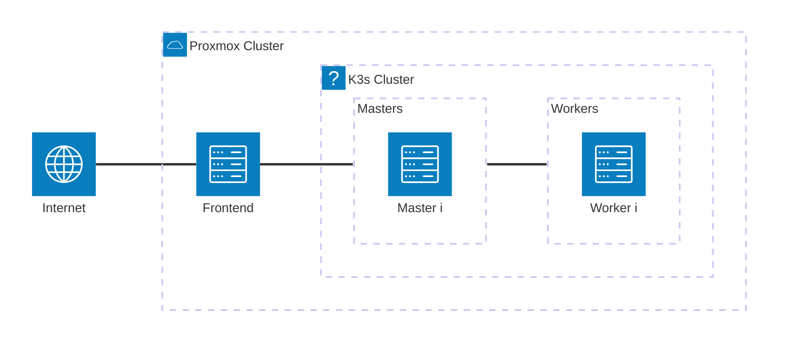

# k3s-cluster-proxmox
K3s cluster built on top of Proxmox cluster

---

## Architecture

```mermaid
architecture-beta
    group cluster(cloud)[Proxmox Cluster] 
    group k3scluster(logos:kubernetes)[K3s Cluster] in cluster
    group masters[Masters] in k3scluster
    group workers[Workers] in k3scluster

    service internet(internet)[Internet]
    service frontend(server)[Frontend] in cluster
    service master1(server)[Master i] in masters
    service worker1(server)[Worker i] in workers
    
    internet:R -- L:frontend
    master1{group}:L -- R:frontend
    worker1{group}:L -- R:master1{group}
```

--- 
## How to use it

1. Clone the repository

2. Edit vars.sh to adjust to your environment.